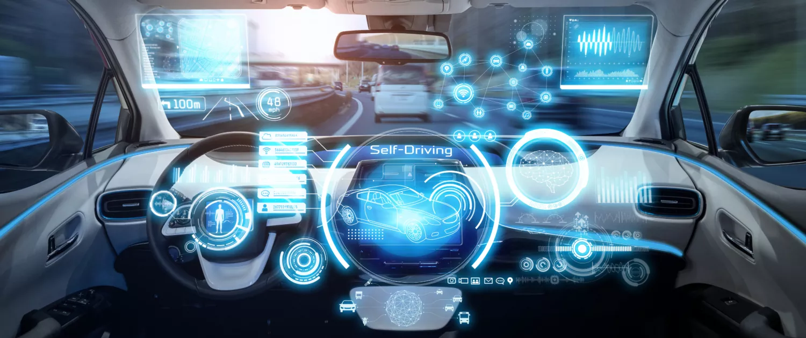

  
  <h3>To run this code on your PC, you should first donwload a game which was developed by <a href="https://github.com/udacity/self-driving-car-sim">Udacity</a> to play and collect training data</h3>
  <h3>When you opened the game, to gain a training data you should choose <i>TRAINING MODE</i> and play. <b>DON'T FORGET!</b> You ought to drive 5 laps forward and turn around, then again drive 5 laps forward, otherwise your car may get in trouble when driving on its own. When you are driving, game itself saves all the photos in format <i>jpg</i> in the folder <i>SimulationData</i> which will be your training data and one <i>csv</i> file to read all the information in <b>Pandas</b>. After all you will open the game again and choose <i>AUTONOMOUS MODE</i> and enjoy the driving of your car without your interference</h3>

